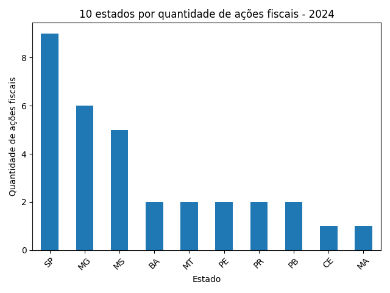
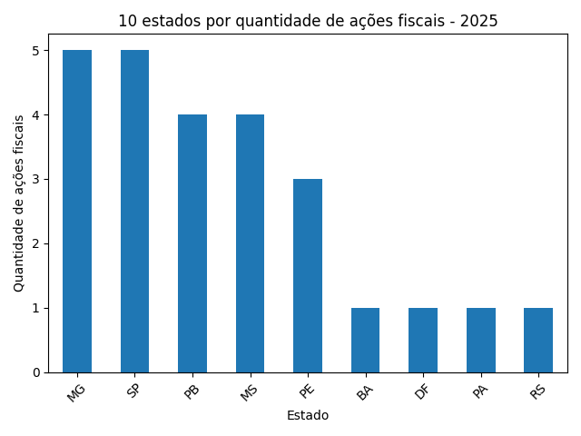
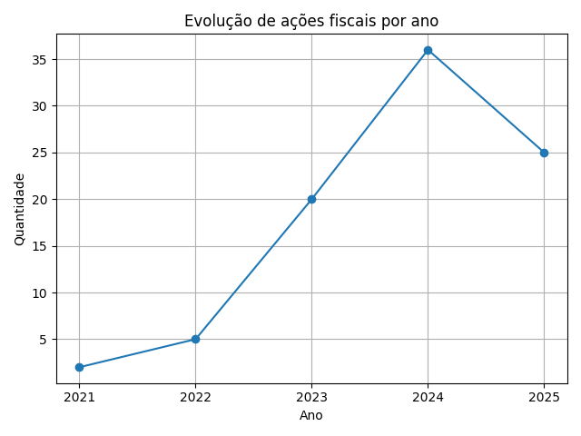
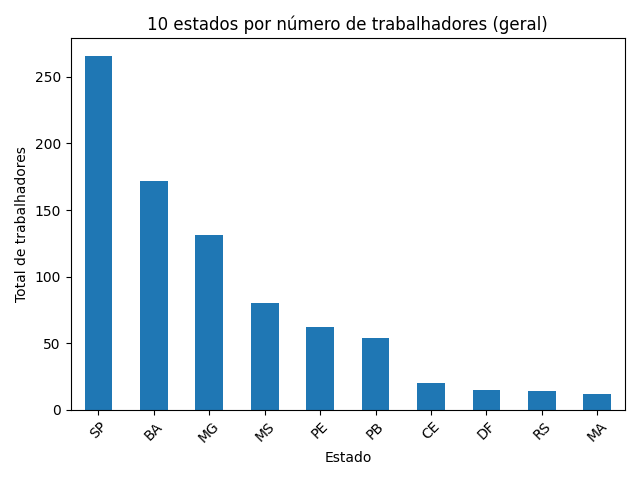
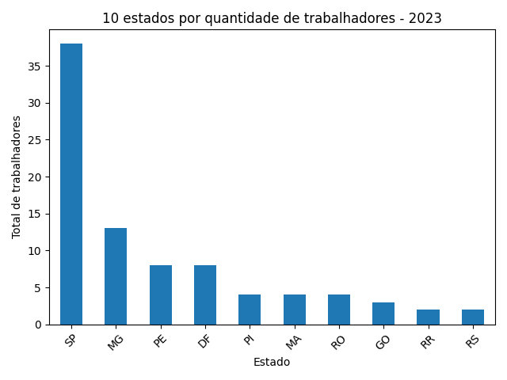
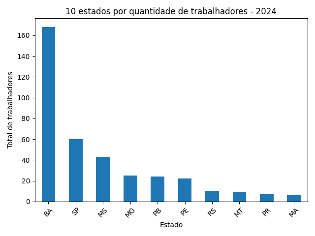
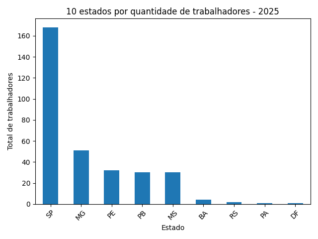
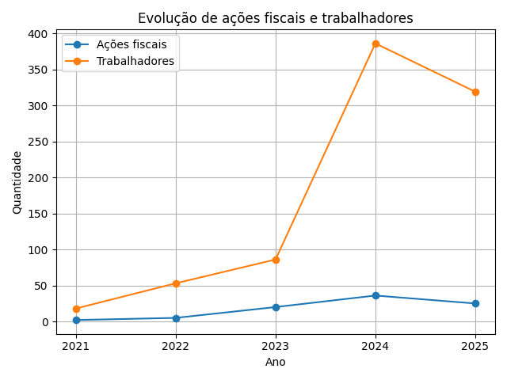

# 📊 Análise de Ações Fiscais e Trabalho Análogo à Escravidão no Brasil

Este projeto realiza a extração, tratamento e análise de dados do cadastro oficial de empregadores flagrados utilizando trabalho em condições análogas à escravidão no Brasil.

---

## Fonte dos dados

Dados oficiais disponíveis em:

https://www.gov.br/trabalho-e-emprego/pt-br/assuntos/inspecao-do-trabalho/areas-de-atuacao/cadastro_de_empregadores.pdf

- Formato original: PDF
- Extração automatizada via Python

---

## Tecnologias utilizadas

- Python
- pandas
- matplotlib
- pdfplumber

---

## Pipeline do projeto

1. Extração de dados do PDF
2. Limpeza e estruturação em DataFrame
3. Análise exploratória
4. Geração de gráficos

---

## Resultados

### Estados por ações fiscais (por ano)

#### 2024


#### 2025


#### 2026


---

### Evolução de ações fiscais por ano



---

### Estados por número de trabalhadores (geral)



---

### Estados por número de trabalhadores (por ano)

#### 2023


#### 2024


#### 2025


#### 2026


---

### Evolução de ações fiscais e trabalhadores



---


## Limitações

- A extração pode não capturar 100% dos registros
- Possíveis inconsistências nos dados extraídos

---

## Como executar :

### 1. Clone o repositório

```bash
git clone https://github.com/seu-usuario/seu-repo.git
cd seu-repo

pip install -r requirements.txt

python analisadado.py ```


#### Autor:

Renan Tomazini e Copilot (apenas sintaxe, recuse trocar sua cognição pela máquina)
